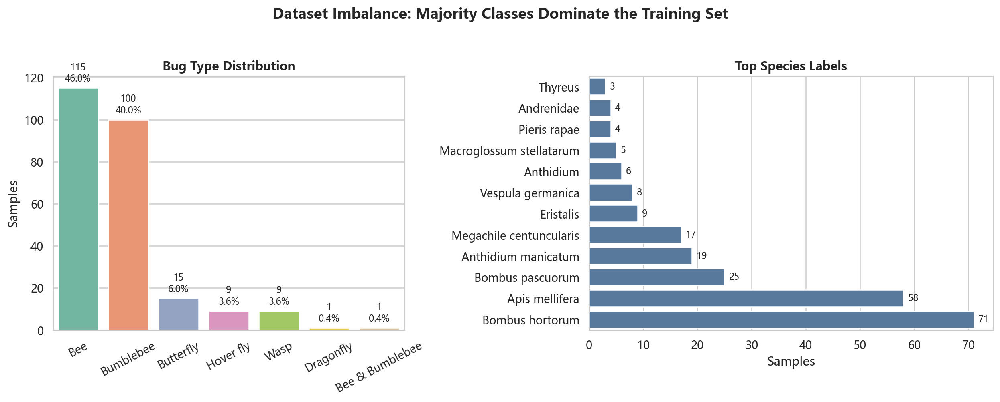
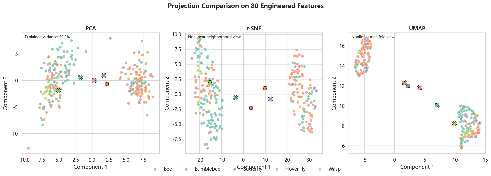
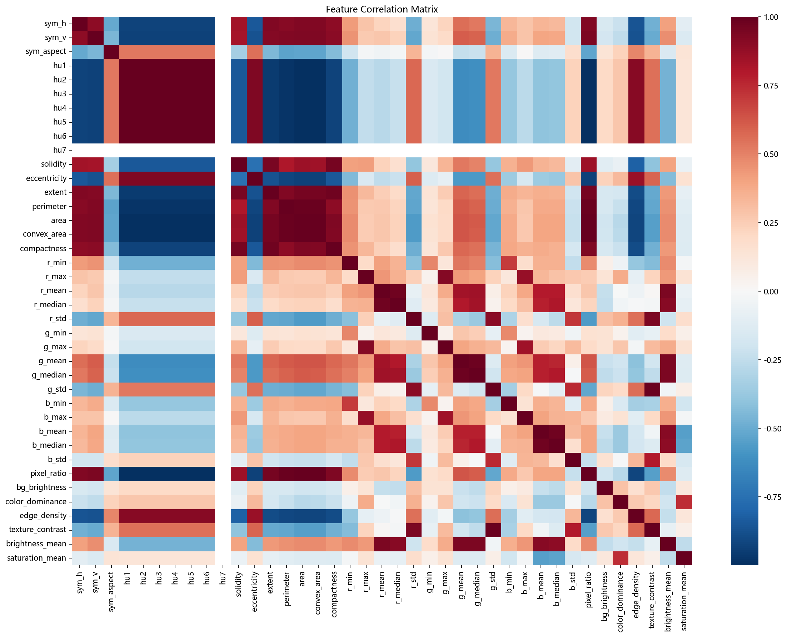
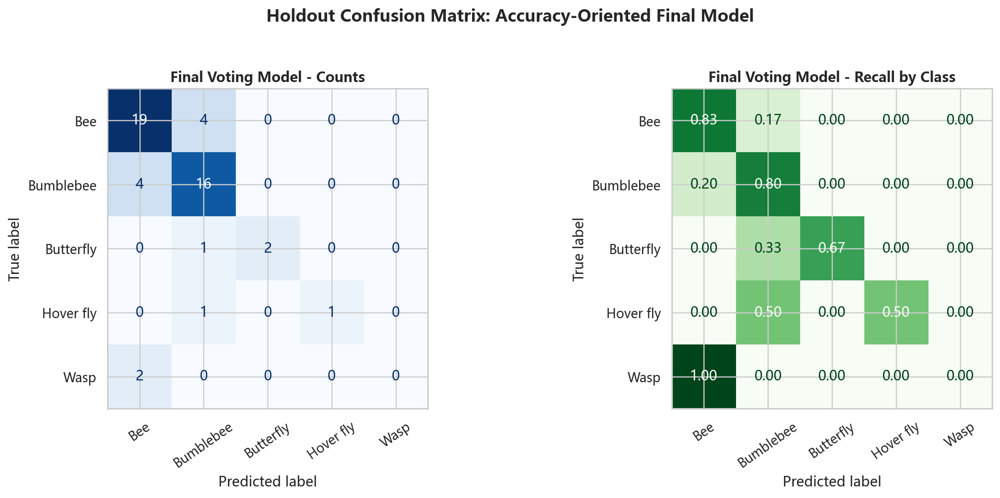
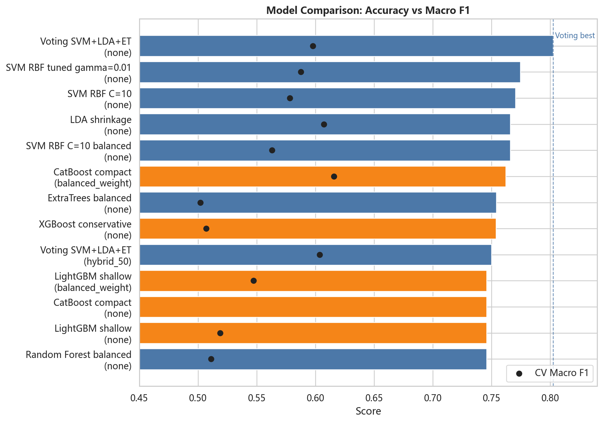
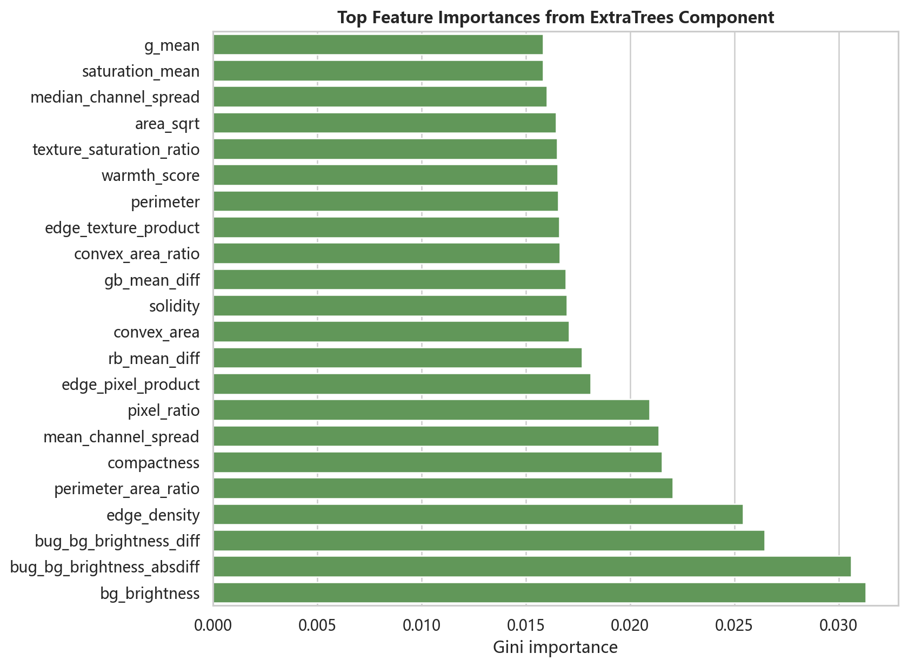
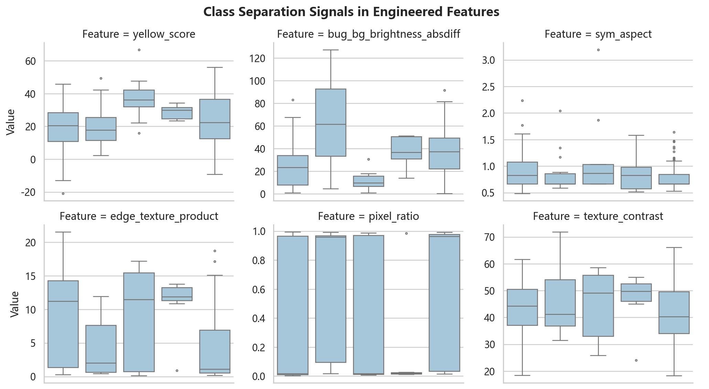

# To Bee or Not To Bee - Machine Learning Report

Course: IG.2412  
Date: 2026-06-06  
Task: classify pollinator insects from masked high-resolution images.

## Executive Summary

This project extracts shape, color, texture, and symmetry features from pollinator insect
images and trains machine learning models to predict the `bug type` label. The original
feature set contains 39 numeric features. A corrected validation workflow and 41 engineered
features were added, producing an 80-feature table.

The best accuracy-oriented model is a soft voting ensemble combining SVM, shrinkage LDA,
and ExtraTrees. It achieved a 5-fold cross-validation accuracy of 0.8024
+/- 0.0462 and a holdout accuracy of 0.7600.
A second balanced-class SVM model was also saved for cases where minority-class recall is more
important than plain accuracy.

## Dataset

The available training set contains 250 labeled samples. Images 1-250 have segmentation
masks and labels; images 251-347 are the hidden test set described in the project brief.
The current workspace does not contain the hidden `test/` images, so this report focuses on
training/validation and model selection.

Raw class distribution:

| bug type | count |
| --- | --- |
| Bee | 115 |
| Bumblebee | 100 |
| Butterfly | 15 |
| Hover fly | 9 |
| Wasp | 9 |
| Dragonfly | 1 |
| Bee & Bumblebee | 1 |

For cross-validation, `Dragonfly` and `Bee & Bumblebee` were removed because each has only
one sample, which is not enough for stratified folds. The evaluated five-class setup is:

| bug type | count |
| --- | --- |
| Bee | 115 |
| Bumblebee | 100 |
| Butterfly | 15 |
| Hover fly | 9 |
| Wasp | 9 |

Top species labels:

| species | count |
| --- | --- |
| Bombus hortorum | 71 |
| Apis mellifera | 58 |
| Bombus pascuorum | 25 |
| Anthidium manicatum | 19 |
| Megachile centuncularis | 17 |
| Eristalis | 9 |
| Vespula germanica | 8 |
| Anthidium | 6 |
| Macroglossum stellatarum | 5 |
| Andrenidae | 4 |

## Feature Extraction

Base features were computed from each image and mask:

- Symmetry: horizontal and vertical mask overlap plus aspect ratio.
- Shape: Hu moments, solidity, eccentricity, extent, perimeter, area, convex area, compactness.
- Color: RGB min/max/mean/median/std inside the bug mask.
- Size/background: bug pixel ratio and background brightness.
- Texture/appearance: color dominance, edge density, texture contrast, brightness mean, saturation mean.

Feature engineering then added 41 derived features, including RGB ranges, channel ratios,
yellow/darkness proxies, bug-background brightness differences, symmetry interactions,
shape ratios, Hu moment aggregates, and edge-texture products.

## Visual Exploration

The enhanced distribution plot shows a strong class imbalance: Bee and Bumblebee dominate
the dataset, while Butterfly, Hover fly, and Wasp have far fewer examples. The combined
PCA/t-SNE/UMAP panel uses the 80 engineered features and shows partial class separation,
but Bee/Bumblebee overlap remains substantial. The final-model confusion matrix and feature
importance plot make the selected model easier to interpret.

## Modeling Protocol

The original notebook scaled all samples before cross-validation. This was corrected by
placing `StandardScaler` inside sklearn `Pipeline` objects, so scaling is fitted only on
training folds. Evaluation used stratified 5-fold cross-validation and a fixed 80/20 stratified
holdout split for additional sanity checks.

Metrics:

- Accuracy: main likely leaderboard metric.
- Balanced accuracy and macro F1: useful because minority classes are small.
- Per-class precision/recall/F1: used to inspect failure modes.

## Initial Models and Clustering

Initial notebook results:

| Model | Score |
| --- | --- |
| Logistic Regression | 0.7094+/-0.0504 |
| KNN (k=5) | 0.7220+/-0.0449 |
| SVM (RBF) | 0.7178+/-0.0415 |
| Random Forest | 0.7253+/-0.0654 |
| KMeans | Sil=0.1876\|ARI=0.0808 |
| DBSCAN | Sil=0.6111\|ARI=0.0814 |
| LDA | 0.7420+/-0.0391 |

KMeans and DBSCAN were included as unsupervised clustering baselines. Their adjusted Rand
index scores are low, showing that unsupervised clusters do not naturally recover the target
classes from the hand-crafted feature space.

## Tuned Supervised Models

The first tuned supervised comparison used Logistic Regression, KNN, SVM, Random Forest,
Gradient Boosting, and LDA:

| Model | CV Mean | CV Std | Test Acc |
| --- | --- | --- | --- |
| Logistic Regression (balanced) | 0.6407 | 0.0725 | 0.6800 |
| KNN (best) | 0.7382 | 0.0524 | 0.6000 |
| SVM (best) | 0.7623 | 0.0436 | 0.7000 |
| Random Forest (best) | 0.7053 | 0.0594 | 0.7000 |
| Gradient Boosting | 0.6850 | 0.0683 | 0.6400 |
| LDA | 0.7420 | 0.0391 | 0.7000 |

SVM had the strongest cross-validation accuracy among these classic models, while SVM,
Random Forest, and LDA tied on the holdout split.

## Corrected Validation and Engineered Features

After correcting the scaler placement, the original SVM score was lower than in the notebook,
indicating mild data leakage in the earlier validation workflow. Adding engineered features
recovered and improved performance:

- Corrected original-feature SVM CV accuracy: 0.7504
- Engineered-feature SVM CV accuracy: 0.7702
- Engineered-feature voting ensemble CV accuracy: 0.8024

## Class Imbalance Experiments

The dataset is imbalanced, so the advanced sweep tested:

- no resampling
- equal oversampling of minority classes
- `hybrid_50`, resampling each class toward roughly half the majority size
- mild undersampling of dominant classes

Top advanced modeling results:

| Model | Imbalance Strategy | CV Accuracy Mean | CV Macro F1 Mean | Holdout Accuracy | Holdout Macro F1 |
| --- | --- | --- | --- | --- | --- |
| Voting SVM+LDA+ET | none | 0.8024 | 0.5979 | 0.7600 | 0.6040 |
| SVM RBF tuned gamma=0.01 | none | 0.7744 | 0.5876 | 0.7200 | 0.4860 |
| SVM RBF C=10 | none | 0.7702 | 0.5783 | 0.7000 | 0.4771 |
| LDA shrinkage | none | 0.7660 | 0.6071 | 0.7200 | 0.6840 |
| SVM RBF C=10 balanced | none | 0.7660 | 0.5630 | 0.7400 | 0.6058 |
| ExtraTrees balanced | none | 0.7540 | 0.5019 | 0.6800 | 0.2958 |
| Voting SVM+LDA+ET | hybrid_50 | 0.7500 | 0.6037 | 0.7400 | 0.6957 |
| Random Forest balanced | none | 0.7456 | 0.5112 | 0.7000 | 0.3011 |
| HistGradientBoosting | none | 0.7420 | 0.5080 | 0.7600 | 0.4536 |
| Voting SVM+LDA+ET | undersample_mild | 0.7379 | 0.5927 | 0.7000 | 0.6256 |

## XGBoost, LightGBM, and CatBoost

Additional boosted-tree libraries were tested on the same 80 engineered features. The sweep
included XGBoost, LightGBM, and CatBoost with no resampling, balanced sample weights,
equal oversampling, and hybrid_50 resampling.

| Model | Family | Imbalance Strategy | CV Accuracy Mean | CV Macro F1 Mean | Holdout Accuracy |
| --- | --- | --- | --- | --- | --- |
| CatBoost compact | catboost | balanced_weight | 0.7620 | 0.6158 | 0.6400 |
| XGBoost conservative | xgboost | none | 0.7537 | 0.5069 | 0.7000 |
| LightGBM shallow | lightgbm | balanced_weight | 0.7458 | 0.5473 | 0.6800 |
| CatBoost compact | catboost | none | 0.7457 | 0.4387 | 0.7000 |
| LightGBM shallow | lightgbm | none | 0.7456 | 0.5190 | 0.7000 |
| XGBoost deeper | xgboost | none | 0.7456 | 0.4735 | 0.7200 |
| LightGBM compact | lightgbm | balanced_weight | 0.7418 | 0.5345 | 0.6800 |
| LightGBM compact | lightgbm | none | 0.7418 | 0.4904 | 0.6800 |

The best boosted-tree result by CV accuracy was `CatBoost compact` with
`balanced_weight`, reaching 0.7620 CV accuracy.
This did not exceed the soft voting ensemble at 0.8024. The best
boosted-tree macro-F1 model was `CatBoost shallow`, but its holdout macro F1 was only
0.3208, so it was not selected as the final model.

The accuracy winner used no resampling. The best macro-F1-oriented model was
`SVM RBF C=10` with `hybrid_50`. This trade-off matters:
resampling improves minority-class attention but can reduce plain accuracy.

## Final Model Selection

Accuracy-oriented final model:

- File: `best_model_engineered.pkl`
- Model: Voting SVM+LDA+ET
- Imbalance strategy: none
- CV accuracy: 0.8024 +/- 0.0462
- CV macro F1: 0.5979
- Holdout accuracy: 0.7600

Balanced-class alternative:

- File: `best_model_engineered_balanced.pkl`
- Model: SVM RBF C=10
- Imbalance strategy: hybrid_50
- CV accuracy: 0.7136 +/- 0.0505
- CV macro F1: 0.6120
- Holdout macro F1: 0.6389

## Prediction Pipeline

To predict images 251-347 when the test images become available:

1. Extract the same 39 base features from each test image and mask.
2. Apply `add_engineered_features` to create the 80-feature representation.
3. Select the saved `feature_cols` from `best_model_engineered.pkl`.
4. Call the saved voting ensemble model and write a CSV with columns `ID` and `bug type`.

## Limitations

The rare one-sample classes were excluded from cross-validation and the saved final models
predict five classes. If the hidden test set contains `Dragonfly` or `Bee & Bumblebee`,
a separate fallback strategy would be needed. The small number of Hover fly and Wasp samples
also makes their validation scores volatile.

## Conclusion

The final recommended system uses engineered hand-crafted features and soft voting model
fusion. Compared with the corrected single SVM baseline, the ensemble improves cross-validation
accuracy from 0.7504 to 0.8024 and improves holdout accuracy to
0.7600. This is the strongest current candidate for the hidden test
predictions, assuming the final score is based primarily on plain classification accuracy.
